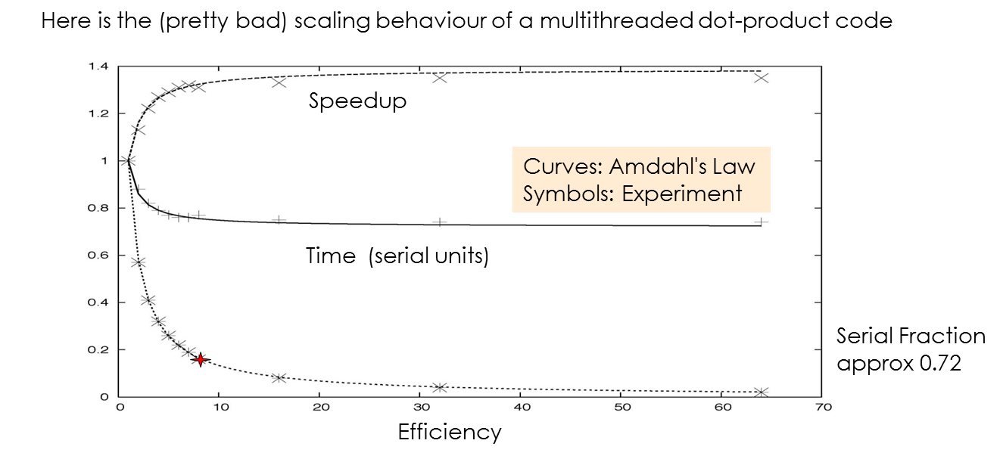

> ##  Outline {.objectives}
> * Parallel computing and parallel programming
> * Multithreading and shared-memory machines
> * MPI and distributed clusters
> * MPI Runtime environments
> * Simple examples : Hello World, Sum of Square Roots

## Moore's Law

Sometimes computational task are very demanding. A lot of memory my be
required to keep large amounts of data around for easy
access. Arithmetic operations may be complex and there may be billions
of them. A routine may have to be executed a very large number of
times to arrive at a result. An increase in computational workload
calls for an increase in computational resources. In the past that
usually meant that one needed a better, i.e. a faster
computer. Luckily, computers had a way to satisfy these increasing
demands by doubling their capacity every couple of years. In fact, one
could count on it, and this observation was given a name: <a
href="https://en.wikipedia.org/wiki/Moore%27s_law">Moore's
Law</a>. Here's a picture of it (thanks, reddit):

The capacity of a computer's processing unit is roughly proportional
to the number of transistors you can cram on it. Note that the y-axis
of this graph is logarithmic. We can see that the number of
transistors increases by an order of magnitude every 6 or 7 years. In
recent times though, the "chips"" we are looking at are of the
"multicore" variety, i.e. they have more than one processing unit on
it. This is generally the case: In the last two decades improvement of
computers has been largely due to "more" rather than
"faster". Computing has turned parallel. What exactly does that mean?

## Parallelism

As usual, Wikipedia has the answer:

~~~ {.python}
Parallel computing is a type of computation in which many calculations are carried out simultaneously, operating on the principle that large problems can often be divided into smaller ones, which are then solved at the same time.
~~~

The key point is of course the division of larger problems into
smaller ones. Each of the smaller problems can be tasked to a separate
computing units, i.e . A core, a CPU, a chip, a machine etc. For this
to work though, there is one more crucial condition:

~~~ {.output}
The sub-tasks in a parallel computation must be independent from each other.
~~~

If one task is independent from the other we can do them all
simultaneously on different components. If one depends on an other,
i.e. I can only work on one after I have completed another, I end up
having to do them in order, and I gain nothing. So the first step in
"parallelizing" a program is to identify how to split the workload
into preferably equal sub-tasks that have little or nothing to do with
each other. The next step is to send these to different
processors. There is many ways to do this, and we will learn about
some of them.

So the point is to have multiple processes going on simultaneously,
each acting independently, but overall working on the same overall
project. They can be sent to the different hardware components we have
available, for instance the cores in a multicor machine or the nodes
in a cluster. Usually it is the user who determines how many of these
workers they want to be there. The system has a limited number of
processors, of course, and quite often it is left to the machine to
figure out on which part of these the job is actually running. Note
that the number of processes we start is not necessarily the same a
the number of cores/chips/nodes etc we have available. You can run 100
processes on a handful or processors, but that may not be a good idea.

## Load Balancing

One really important thing is to make sure that all the processes do
approximately the same amount of work. If we don't make sure of that,
we end up some of them sitting around doing nothing most of the time.

This is not as easy as it may seem. Sometimes all that is required to
distribute a workload is to let one process do some of the iterations
in a loop, and another does the others. If we give each the same
number of iterations to do, and most of the work's done in that loop,
we're good. That is the case in our example below, but sometimes it
may not. If each of the iterations takes a wildly differing time to
do, we may inadvertedly incur load imbalances. There's things we can
do about that, but that's a bit outside of the scope here.

## Sum of Square Roots

For now let's look at how a parallel program runs. In the directory
~/sqroots you find a program "sqroots" which computes the sum of the
square roots of consecutive integers from 0 to a maximum one N. If N
is chosen large enough (of the order of billions) it is worth while to
do this in parallel. Most of the computational work is in the
computation of the square roots, while the sum is almost
negligible. We can therefore compute the sum of a subset of the roots
on one processor and others on another. At the end we sum all the
partial sums into a total sum. That should reduce the runtime because
the partial sums stand to take proportionally less time than the
total.

The program "sqroots" was written in Fortran, but that shouldn’t
bother us. It uses a parallel system called "OpenMP" that is used for
multicore "shared memory" machines, but that shouldn’t bother us
either. To tell the system how many processors we want to use, we need
to set a so-called environment variable called OMP_NUM_THREADS, which
we can do by preceding the program call with the setting:

~~~ {.python}
OMP_NUM_THREADS=2 ./sqroots.exe
1234567
~~~
~~~ {.output}
  Result =   914494295.63120651
~~~

Here we are running with two processors. Since we have chosen the
maximum number N a bit small, it was over too quickly for us to tell
the difference between different processor numbers. Also it may turn
out to be a bit tedious to re-type the number all the time. So we can
write the number first into a file, then re-use the file. Finally it
would be best to measure the runtime automatically. The easiest way to
do this using the "time" Unix function.

~~~ {.python}
$ echo 1234567890 > sqroots.in
$ OMP_NUM_THREADS=1 time -p ./rootsum.exe <rootsum.in
~~~
~~~ {.output}
  Result =   28918862541603.5
real 6.03
user 6.02
sys 0.00
~~~
~~~ {.python}
$ OMP_NUM_THREADS=2 time -p ./rootsum.exe <rootsum.in
~~~
~~~ {.output}
  Result =   28918862541602.9
real 3.60
user 6.62
sys 0.00
~~~
~~~ {.python}
$ OMP_NUM_THREADS=4 time -p ./rootsum.exe <rootsum.in
~~~
~~~ {.output}
  Result =   28918862541602.8
real 2.00
user 7.98
sys 0.00
~~~
~~~ {.python}
$ OMP_NUM_THREADS=8 time -p ./rootsum.exe <rootsum.in
~~~
~~~ {.output}
  Result =   28918862541603.0
real 0.80
user 6.07
sys 0.00
~~~

## Scaling and Amdahl's Law

Looks like the time is substantially reduced in each step. Ideally, we
would like the time to be reduced by half whenever we double the
number of processes. To be sure that's not quite the case here. This
may have various reasons, such as other people using resources on the
system, or parts of the program not running properly in parallel. The
ratio between the serial and the parallel runtime is called "speedup":

We'd like that number to be equal to the number of processors, i.e. if
we are using 8 processors then the serial runtime should be 8 times as
large as the parallel one. This is called "ideal" or "linear"
scaling. It can be achieved for smaller numbers of processors, but as
the number increases it gets harder and harder to do it. One
limitation may be that not everything in your program runs actually in
parallel. If that's the problem, "Amdahl's Law" kicks in. It gives you
a rule of thumb what kind of speedup you can expect if you are using a
number of processors but a part of your code runs in serial:

Fs is the fraction of the code that's serial, and p is the number of
processes you're using. Smax is the best speedup you can expect under
those circumstances. For instance if you got 2 processes running in a
half-serial program you end up with a speedup of 4/3 although you'd
like to have 2. You can also see that no matter how many processes you
run you can never do better than 1/2 because the other half is still
running in serial. Here is a picture of a pretty brutal case of
Amdahl's Law:

Three quarters of what this program does happens in serial mode, and
we can see how quickly the speedup "bends away" from linear. By the
way, this gives you a good rule of thumb: "Don't use more processors
for your program than the inverse of its serial portion". So if you
got about 1% of your code still running in serial, don't use more than
100 processors.

## Hello World

Now let's get something to run with multiple processes. We try this
out with the usual "Hello World" example. Let's make a bunch of
processes and have them print out a message to the screen. We can't
use the command line approach for this because we need to start
everything with an "mpirun" command. So first we have to type in the
program in an editor. Let's do it step by step:

First we need a header line that lets the system know that we are
using Python 3:

~~~ {.python}
#!/usr/bin/env python3
~~~

The "hash-bang" header is often necessary if we want execute a script
without spelling out what language we're using every time. Next we
have to import the MPI interface for python:

~~~ {.python}
from mpi4py import MPI
~~~

Note that this also causes MPI to be initialized, so we won't have to
call MPI_INIT. Thanks, MPI4Py.

Let's safe here and try out if anything breaks:

~~~ {.python}
$ mpirun -np 8 ./hello.py
~~~

If we did anything wrong or we're not set up right, then we'll get an
error message here. If everything's OK, we get nothing. With larger
number of processors we may get a warning like this

~~~ {.python}
$ mpirun -np 12 ./test0.py
~~~
~~~ {.error}
--------------------------------------------------------------------------
A request was made to bind to that would result in binding more
processes than cpus on a resource:

   Bind to:     CORE
   Node:        hc10
   #processes:  2
   #cpus:       1

You can override this protection by adding the "overload-allowed"
option to your binding directive.
--------------------------------------------------------------------------
~~~

That's because the nodes we're playing with have only 8 cores and
we're trying to run more than 8 processes on it. Let's stick with 8 or
less.

Next we need to define a "communicator" which is a communication
system. We will go into details later:

~~~ {.python}
comm = MPI.COMM_WORLD
~~~

Then make MPI calls to determine the rank, which is a unique number
(like a name) for each of the processes. We also find the size, which
is the total number of processes:

~~~ {.python}
rank = comm.Get_rank()
size = comm.Get_size()
~~~

Note how the rank and size are part of the communicator "comm" which
we have set to the default MPI_COMM_WORLD.  Finally, print out the
famous "Hello World" message:

~~~ {.python}
print ("Hello World from rank ",rank," of a total of ",size,"processes")
~~~

Save here and try it out with 8 processors:

~~~ {.python}
$ mpirun -np 8 ./hello.py
Hello World from rank  1  of a total of  8 processes
Hello World from rank  2  of a total of  8 processes
Hello World from rank  4  of a total of  8 processes
Hello World from rank  5  of a total of  8 processes
Hello World from rank  6  of a total of  8 processes
Hello World from rank  7  of a total of  8 processes
Hello World from rank  0  of a total of  8 processes
Hello World from rank  3  of a total of  8 processes
~~~

Note how the ranks are slightly out of order. As mentioned before rank
has nothing to do with the order in a parallel program. The only
reason we don't get a "jumbled mess" on the screen is because the
system has an IO buffer and pre-orders things a little to make them
readable.

## The sum of square roots, again

Let's look at an example we have already encountered earlier. The sum
of square roots of integers, ranging from 0 to a maximum number m. We
looked at a multithreaded version of that program that was programmed
in Fortran, which is a rather low-level programming language that is
nowhere as sophisticated as Python. (However, compared with Python,
it's blazingly fast!)

The way we want to go about it is like this:
* First we determine which of the square roots are computed by which process. A reasonable choice is to go about it round-robin: if we have 4 processes, number 0 does 0, 4, 8, 12 ...; number 1 does 1, 5, 9, 13 ...; etc.
* We have each of the process compute a partial sum that includes all the square roots it evaluated.
* Finally, we sum up all the partial sums into a total sum and have that printed out by one of the processes (as usual that would be the one with rank 0)

For starters, let's copy out hello world example again so we don't type ouselves to death:

cp ./MPIhello.py ./MPIrootsum.py

Then we edit the new MPIrootsum.py. Let's delete "Hello World" line:

~~~ {.python}
#!/usr/bin/env python3

from mpi4py import MPI

comm = MPI.COMM_WORLD
rank = comm.Get_rank()
size = comm.Get_size()
~~~

We need a few extra packages: 

* numpy because numpy arrays work best with MPI4py, particularly if we don't want to explicitely type our data.
* math because we need a square root (not really required, numpoy has one as well)
* time because we want to insert some timing routines to check if our program scales nicely.

Let's add the corresponding lines below the one that imports MPI:

~~~ {.python}
import math
import numpy as np
import time as tm
~~~

Next thing to do is make three variables we will need for the
computation: The maximum number m, the partial sum "partial", and the
result "total". We make them all into "numpy arrays" of only one
element, so our life is easier with the MPI function calls.

~~~ {.python}
m=np.zeros(1)
total=np.zeros(1)
partial=np.zeros(1)
~~~

Now we have one of the processes (rank 0) read in the maximum number m
from the console. Also, at this point we want to "start to clock" for
our timing. We do that after reading in m, because we don't want to
measure how long it takes us to hammer in a number.

~~~ {.python}
if rank == 0:
    m[0]=input("Please give the maximum integer m:")
    start=tm.time()

~~~

Don't forget the blank line at the end.

At this point, only rank 0 knows m because only it has read it from
the console. So now we need a "broadcast" so that all others get that
information as well.

~~~ {.python}
comm.Bcast(m, root=0)
~~~

After that, we can use m in a loop over all integers that the
corresponding process is responsible for. We start with the rank, and
always skip the number of processes, i.e. the size. Note that the
upper limit of the loop looks a bit strange because we passed m as a
numpy array and have to recast it. After we've caculated the partial
sum, we print it out.

~~~ {.python}
for index in range(rank, m[0].astype(int)+1, size):
    partial=partial+math.sqrt(index)

print("The partial sum of rank ", rank, "is", partial[0])
~~~

So now each process has a partial sum but no-one has the final result
yet. So it's time for a Reduce() call, because that is what Reduce()
does: reducing multiple partial to a final total. In our case through
a summation:

~~~ {.python}
comm.Reduce(partial, total, op=MPI.SUM, root=0)
~~~

Almost done. All that remains to do is for the root process (rank 0)
to print out the total, stop the clock and tell us how long the whole
thing took:

~~~ {.python}
if rank == 0:
    print ("The total sum is", total[0])
    end=tm.time()
    print ("This took", end-start, "seconds.")

~~~

Let's try it out.

~~~ {.python}
$ mpirun -np 1 ./MPIrootsum.py
~~~
~~~ {.output}
Please give the maximum integer m:1234567
The partial sum of rank  0 is 914494295.631
The total sum is 914494295.631
This took 4.355911016464233 seconds.
~~~
~~~ {.python}
$ mpirun -np 2 ./MPIrootsum.py
~~~
~~~ {.output}
Please give the maximum integer m:1234567
The partial sum of rank  1 is 457247425.783
The partial sum of rank  0 is 457246869.848
The total sum is 914494295.631
This took 2.1954686641693115 seconds.
~~~
~~~ {.python}
$ mpirun -np 4 ./MPIrootsum.py
~~~
~~~ {.output}
Please give the maximum integer m:1234567
The partial sum of rank  2 is 228623712.97
The partial sum of rank  3 is 228623990.532
The partial sum of rank  0 is 228623156.877
The total sum is 914494295.631
This took 1.1212892532348633 seconds.
The partial sum of rank  1 is 228623435.251
~~~
~~~ {.python}
$ mpirun -np 8 ./MPIrootsum.py
~~~
~~~ {.output}
Please give the maximum integer m:1234567
The partial sum of rank  4 is 114311856.596
The partial sum of rank  7 is 114312272.746
The partial sum of rank  5 is 114311995.354
The partial sum of rank  6 is 114312134.068
The partial sum of rank  2 is 114311578.902
The partial sum of rank  1 is 114311439.898
The partial sum of rank  3 is 114311717.786
The partial sum of rank  0 is 114311300.281
The total sum is 914494295.631
This took 0.5708332061767578 seconds.
~~~
~~~ {.python}
$ mpirun -np 16 ./MPIrootsum.py
~~~
~~~ {.error}
--------------------------------------------------------------------------
A request was made to bind to that would result in binding more
processes than cpus on a resource:

   Bind to:     CORE
   Node:        hc10
   #processes:  2
   #cpus:       1

You can override this protection by adding the "overload-allowed"
option to your binding directive.
--------------------------------------------------------------------------
~~~
~~~ {.output}
Please give the maximum integer m:1234567
The partial sum of rank  2 is 57156067.2986
The partial sum of rank  6 is 57156345.2329
The partial sum of rank  4 is 57156206.3512
The partial sum of rank  5 is 57156275.8075
The partial sum of rank  0 is 57155927.3803
The partial sum of rank  1 is 57155997.6372
The partial sum of rank  9 is 57155442.2604
The partial sum of rank  11 is 57155580.9312
The partial sum of rank  10 is 57155511.6034
The partial sum of rank  8 is 57155372.9007
The partial sum of rank  3 is 57156136.8543
The partial sum of rank  13 is 57155719.5464
The partial sum of rank  14 is 57155788.8355
The partial sum of rank  12 is 57155650.2452
The partial sum of rank  7 is 57156414.6331
The partial sum of rank  15 is 57155858.1132
The total sum is 914494295.631
This took 0.8241209983825684 seconds.
~~~

The result's the same in all cases, and it scales pretty good up to 8
processes. If we're trying to double up to 16, then we get a warning
from the system that we don't have that many cores, but it does it
anyway. As you can see, the timing is worse than with 8 cores, so it
definitely does not pay to overload the hardware and run more
processes than you've got cores.

Note that while the python program here scales well enough, it is
slower than a C or or FORTRAN version by a factor of several hundered.

