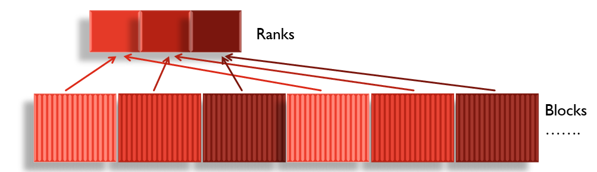
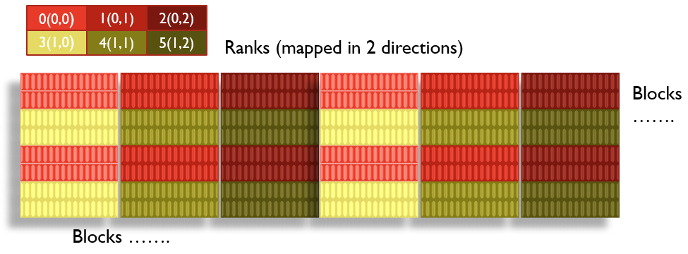

> ##  Outline
> * Extensions to 2D and 3D
> * Cyclic block distribution
> * Stuff we have not touched
> * Higher-Level packages and libraries

## Finite differences in more than 1D

The extension of the simple approximation of the 1D heat equation
to more than 1 dimension is rather straight-forward. Assuming that we have the same heat conductivity in both directions, and still ignoring any source terms we have:

~~~~{.python}
du/dt = k * (d2u/dx^2 + d2u/dz^2)
~~~~

which can be discretized the same way as in one direction, just
yielding a somewhat longer expresssion

~~~~{.python}
[u(n+1,i,j) - u(n,i,j)]/dt =
k * {[u(n,i,j+1)-2*u(n,i,j)+u(n,i,j-1)]/(dx)^2} +
     [u(n,i+1,j)-2*u(n,i,j)+u(n,i-1,j)]/(dz)^2}
~~~~
This assumes an isotropic Cartesian grid, and since it's best to use
the same spacing in both direction, we may as well set dx=dz=d. The
indices j and i are counting the gridpoints in x and z direction,
respectively. Everything else is like in 1D. In the case of three
dimensions we'd have three terms and indices, but the basic form is
the same.

If the conductivity term k is not the same for the directions, or if
the grid is not chosen equal in all directions, things get more
complicated. Also, the approximation of the Laplacian by a simple
thre-point formula may not be accurate enough. In several dimensions
things may be inhomogeneous enough to warrant a different coordinate
system than a simple Cartesian one. The situation may make itr
impossible to properly separate variables, etc.

Still, the principle remains the same:

* approximate the continuous solution of the differential equation by
  discret points on a grid

* write the derivatives as an expression in terms of the gridpoints
  and nearby "neighbours"

* solve for the value of the gridpoints in the "next" time step

* initialize with the stareting distribution

* enforce boundary conditions at each step

## Domain decomposition in 2D and 3D

Domain decomposition is easy on a Cartesian grid. If the grid is
homogeneous, isotropoic, and Cartesian, we can limit the number of
data that have to be fetched in each step by, for instance distribute
the workload (and memory) only in one direction. For a 3D domain, this
corresponds to "slabs", for 2D it's "strips". For some cases, the Grid
can't be chosen to be homogeneous, though. For more complicated
domains or more sophisticated dynamics, there may be regions of "more
action" that have to be covered by a denser grid. Or worse, the time
scale of what's going on may be different. The potential for
complexity is unlimited.

Much of the effort of working with grid based methods in more complex
cases goes into constructing a grid that covers the regions and time
scales of interest in such a way that the computational load on each
of the processes is approximately equal. Because you are on a time
scale, the iterations are dependent, and you may have to "redraw" the
grid every so often to adapt to the changing circumstances.

## Assignment: Converting from 1D to 2D

~~~~{.python}
#! /usr/bin/env python3

import cmath
import time as tm
import matplotlib.pyplot as plt
import numpy as np
import sys

from mpi4py import MPI

# This is a 2D extension of the MPIheat1D code discussed earlier
# Parallelization is in one direction only (X-strips)
# The mesh has the same range (square domain) and grid density in both directions
# Conductivity is the same as well

def timestamp() :
    print ( "Local time : ", tm.ctime( tm.time() ) )
    return

def initial_condition ( x, y, time ):
    value = 95.0
    return value

def rhs ( x, y, time ) :
    value = 0.0
    return value

def boundary_condition ( x, y, time) :

    if ( x < 0.5 or y < 0.5) :
        value = 100.0 + 10.0 * np.sin ( time )
    else :
        value = 75.0
    
    return value

# Top of update routine
def update(id,p) :
 
    j_min = 0
    j_max = 20
    k = 0.002
    n = 11
    time_max = 10.0
    time_min = 0.0
    x_max = 1.0
    x_min = 0.0
    
    if ( id == 0 ) :
        print ( "" )
        print ( "  Compute an approximate solution to the time dependent" )
        print ( "  two dimensional heat equation:" )
        print ( "" )
        print ( "    dH/dt - K * [ d2H/dx2 + d2H/dy2 ] = f(x,t)" )
        print ( "" )
        print ( "  for ", x_min," = x_min < x,y < x_max = ", x_max )
        print ( "" )
        print ( "  and ", time_min," = time_min < t <= t_max = ", time_max )
        print ( "" )
        print ( "  Boundary conditions are specified at " )
        print ( "  (x_min,y), (x_max,y), (x,xmin), (y,xmax)" )
        print ( "  Initial conditions are specified at time_min." )
        print ( "" )
        print ( "  The finite difference method is used to discretize the" )
        print ( "  differential equation." )
        print ( "" )
        print ( "  This uses ", p*n," equally spaced points in X and Y" )
        print ( "  and ", j_max," equally spaced points in time." )
        print ( "" )
        print ( "  Parallel execution is done using ", p," processors." )
        print ( "  Domain decomposition is used. " )
        print ( "  Each processor works on ", n, "nodes in X direction, " )
        print ( "  and shares some information with its immediate neighbors." )
        print ( "  (Strip parallelization) " )  

# Grid : parallel subgrid in X, whole domain in Y
    x=np.zeros(n+2)
    y=np.zeros(p*n+2)
    
    for i in range(n+2) :
        x[i] = ( (id*n+i-1)   * x_max + \
                 (p*n-id*n-i) * x_min ) / \
                 (p*n-1)
        
    for i in range(p*n+2) :
        y[i] = ( (i-1)      * x_max + \
                 (p*n-i)    * x_min ) / \
                 (p*n-1)

# print grid if only one process
    if ( p == 1 ) :
        f = open( "x_data.txt", "w" )
        print( x[1:n+1], file=f )
        f.close()
        f = open( "y_data.txt", "w" )
        print( y[1:p*n+1], file=f )
        f.close()

    time = time_min

# heat matrix in x,y with one extra element around
    h = np.zeros((n+2,p*n+2))
    h_new = np.zeros((n+2,p*n+2))

# initialize active portion, extra elements stay zero
    for i in range(1,n+1) :
        for j in range(1,p*n+1) :
            h[i][j] = initial_condition( x[i], y[j], time )

# deltas in time and space
    time_delta = ( time_max - time_min ) / ( j_max - j_min )
    x_delta    = ( x_max    - x_min    ) / ( p * n - 1     )
    y_delta    = x_delta

# cfl condition for stability
    cfl = k * time_delta / x_delta / x_delta 

    if ( id == 0 ) :
        print ( "" )
        print ( "UPDATE" )
        print ( "  CFLF stability criterion value = ",cfl )

    if ( cfl >= 0.5 ) :
        if ( id == 0 ) :
            print ( "" );
            print ( "UPDATE - Warning!" );
            print ( "  Computation cancelled!" );
            print ( "  CFL condition failed." );
            print ( "  0.5 <= K * dT / dX / dX = ", cfl );
        return
   
# test print of heat data
#    if ( p == 1 ) :
#        f = open ( "h_data.txt" , "a" )
#        print(h)
#        print ( h[1:n+1][1:p*n+1], file=f )

    for j in range(1,j_max+1) :
        time_new = ( (         j - j_min ) * time_max \
                   + ( j_max - j         ) * time_min ) \
                   / ( j_max     - j_min )

# neighboring strips communicated
        if ( id > 0 ) :
            comm.send ( h[1][:], dest=id-1, tag=1 )

        if ( id < p-1 ) :
            h[n+1][:] = comm.recv ( source=id+1, tag=1 )

        if ( id < p-1 ) :
            comm.send ( h[n][:], dest=id+1, tag=2 )

        if ( id > 0 ) :
            h[0][:] = comm.recv (source=id-1, tag=2)

# re-compute next time step by finite difference
        for i in range ( 1, n+1 ) :
            for j in range ( 1, p*n+1 ) :
                h_new[i][j] = h[i][j] \
                + ( time_delta * k / x_delta / x_delta ) \
                * ( ( h[i-1][j] - 2.0 * h[i][j] + h[i+1][j] ) \
                +   ( h[i][j-1] - 2.0 * h[i][j] + h[i][j+1] ) )
                + time_delta * rhs ( x[i], y[j], time )

# boundary conditions replace end values
        if ( 0 == id ) :
            for j in range (1, p*n+1) :
                h_new[1][j] = boundary_condition ( x[1], y[j], time_new )

        if ( id == p-1 ) :
            for j in range (1, p*n+1) :
                h_new[n][j] = boundary_condition ( x[n], y[j], time_new )

        for i in range (1, n+1) :
            h_new[i][1]   = boundary_condition ( x[i], y[1],   time_new )
            h_new[i][n*p] = boundary_condition ( x[i], y[n*p], time_new )

        time = time_new

# update
        for i in range( 1, n+1 ) :
            for j in range( 1, p*n+1 ) :
                h[i][j] = h_new[i][j]

#        if ( p == 1 ) :
#            print( h[1:n+1][1:p*n+1], file=f )
#            print(h)

    if ( p == 1 ) :
        f.close()

    return
# End of update

# ------------------------------
# Main body of the main routine
#-------------------------------

comm=MPI.COMM_WORLD
id=comm.Get_rank()
p=comm.Get_size()
 
if (id==0) :
    timestamp()
    print( "" )
    print( "HEAT_MPI:" )
    print( "  Python/MPI version" )
    print( "  Solve the 2D time-dependent heat equation." )

if (id==0) :
    wtime = MPI.Wtime()     

# main work gets timed
update(id,p)

if (id==0) :
    wtime = MPI.Wtime() - wtime
    print(" ")
    print(" Wall clock elapsed seconds = ", wtime )

MPI.Finalize()

if (id == 0) :
    print( "" )
    print( "HEAT_MPI:" )
    print( "  Normal end of execution." )
    print( "" )
    timestamp ()

# End of main routine
~~~~

## Cyclic Block distribution

In our one-dimensional example, we are splitting up the domain into
approximately equal "chunks" and have each of the processes tackle on
of those segments. Sometimes this appraoch may not be desirable, as it
can lead to an uneven workload, for instance if the required
computations for small grid indices are simpler than for large
ones. In that case we would prefer to choose small block sizes and
give each of the processes more than on block to work through. Clearly
this has the downside of requireing more communication, as each of the
blocks has to communicate with its neighbours, irrespective of the
size: more blocks, more commuinication. But it may be worth it. We
would be distributing the blocks in a "round-robin" way,
i.e. cyclically:

For a two dimensional domain, we can do the distribution in one
direction only, or we can overlay two of these "cyclic blkock
distributions" in both directions. The result is a checker-board like
pattern:

Each of the colors in the above pictures correspond to a different
process that does the computations (and usually receives the data) on
the corresponding blocks. This can be extended to three dimensions (or
more), but let's leave it at this.

While the base pattern here is fairly simple, the computations
required to compute the proper indices for a call to "Scatterv" or a
similar function, are rather tedious. Standard distribution patterns
such as this are often done using functions from parallel computing
packages such as ScaLapack. These are doing the MPI calls "under the
hood", and you use a call to a higher-level function to specify the
basic parameters, such as the size of the full array, the number of
processes, and the blocksize in each direction. The rest happens
automatically.

## Higher-level packages and libraries

MPI is a very powerful parallel tool but it is not exaggeratedly
user-friendly. Because every aspect of a communication operation has
to be handled explicitly, code can become hard to read and therefore
error-prone. Efficient MPI code can be hard to write.

Luckily, many common numerical methods have been programmed based on
the MPI standard that are (quite often freely) available. We cannot
discuss many of them, or even give a comprehensive overview. Instead,
let's focus on one such parallel package that is very commonly used in
technical parallel programming: the ScaLapack library.

## MPI issues we have not discussed

(...coming soon...)
